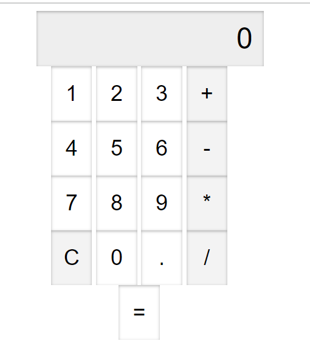
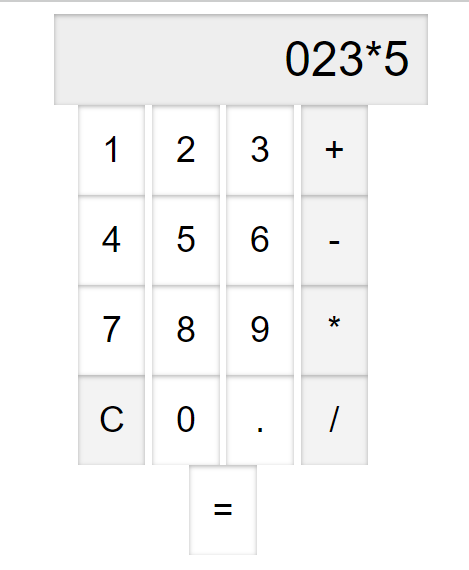
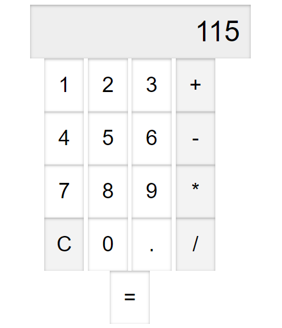

# Chat-Gpt Calculator Example

This is a simple example of how to use the [Chat-Gpt]

Given context :
"bana tuş takımının tasarımınıda içeren 4 işlem yapabilen html css ve javascript kodunu içeren bir hesap makinesi yapabilir misin "

## Screenshots

